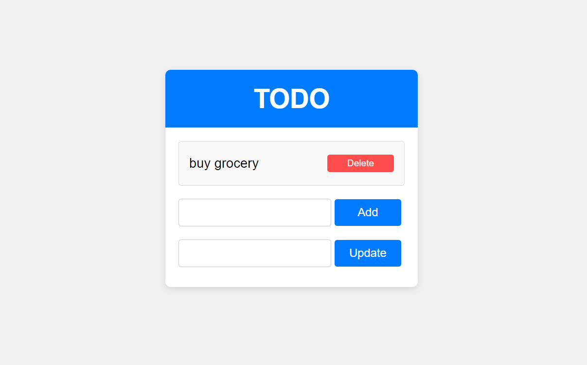

<!-- PROJECT SHIELDS -->
<!--
*** I'm using markdown "reference style" links for readability.
*** Reference links are enclosed in brackets [ ] instead of parentheses ( ).
*** See the bottom of this document for the declaration of the reference variables
*** for contributors-url, forks-url, etc. This is an optional, concise syntax you may use.
*** https://www.markdownguide.org/basic-syntax/#reference-style-links
-->


<!-- PROJECT LOGO -->
<br />
<div align="center">
  <a href="https://github.com/othneildrew/Best-README-Template">
    
  </a>

</div>


<!-- TABLE OF CONTENTS -->
<details>
  <summary>Table of Contents</summary>
  <ol>
    <li>
      <a href="#about-the-project">About The Project</a>
      <ul>
        <li><a href="#features">Features</a></li>
        <li><a href="#built-with">Built With</a></li>
      </ul>
    </li>
    <li>
      <a href="#getting-started">Getting Started</a>
      <ul>
        <li><a href="#prerequisites">Prerequisites</a></li>
        <li><a href="#installation">Installation</a></li>
      </ul>
    </li>
    <li><a href="#contributing">Contributing</a></li>
    <li><a href="#license">License</a></li>
    <li><a href="#contact">Contact</a></li>

  </ol>
</details>


<!-- ABOUT THE PROJECT -->
## About The Project



This project is a simple CRUD (Create, Read, Update, Delete) TODO application built with React for the frontend and Express for the backend. The purpose of this project is to provide a basic example of a full-stack web application, showcasing how frontend and backend technologies can work together to create a seamless user experience.

### Features

1. Add Tasks: Users can add new tasks to their TODO list. Each task has a title and a status (pending/completed).
2. View Tasks: The application fetches and displays all tasks from the backend. Tasks are displayed with their current status.
3. Delete Tasks: Users can delete tasks that are no longer needed.
4. Update Tasks: Users can update the status of a task by double-clicking on it. They can also edit the task title by selecting the task.


<p align="right">(<a href="#readme-top">back to top</a>)</p>


### Built With

* React Js
* Node Js
* Express Js
* MongoDB

<p align="right">(<a href="#readme-top">back to top</a>)</p>


<!-- GETTING STARTED -->
## Getting Started

To get a local copy up and running follow these simple example steps.

### Prerequisites

* Node Js

* npm
  ```sh
  npm install npm@latest 
  ```

### Installation

_Below is an example of how you can instruct your audience on installing and setting up your app. This template doesn't rely on any external dependencies or services._


1. Clone the repo
   ```sh
   git clone https://github.com/LakshyaSuthar03/CRUD_TODO
   ```
2. Install NPM packages
   ```sh
   cd backend
   npm install
   cd..
   cd frontend
   npm install
   ```
3. Setup Environment 
   ```js
    MONGODB_URI = 'mongodb+srv://username:<Password>@cluster0.o01tzdk.mongodb.net/?retryWrites=true&w=majority&appName=Cluster0';
   ```

<p align="right">(<a href="#readme-top">back to top</a>)</p>


<!-- CONTRIBUTING -->
## Contributing

Contributions are what make the open source community such an amazing place to learn, inspire, and create. Any contributions you make are **greatly appreciated**.

If you have a suggestion that would make this better, please fork the repo and create a pull request. You can also simply open an issue with the tag "enhancement".
Don't forget to give the project a star! Thanks again!

1. Fork the Project
2. Create your Feature Branch (`git checkout -b feature/AmazingFeature`)
3. Commit your Changes (`git commit -m 'Add some AmazingFeature'`)
4. Push to the Branch (`git push origin feature/AmazingFeature`)
5. Open a Pull Request

<p align="right">(<a href="#readme-top">back to top</a>)</p>


<!-- LICENSE -->
## License

Distributed under the MIT License. See `LICENSE.txt` for more information.

<p align="right">(<a href="#readme-top">back to top</a>)</p>


<!-- CONTACT -->
## Contact

Lakshya Suthar - (https://www.linkedin.com/in/lakshyasuthar/) - 12102003lakshyasuthar@gmail.com

Project Link: [https://github.com/LakshyaSuthar03/CRUD_TODO](https://github.com/LakshyaSuthar03/CRUD_TODO)

<p align="right">(<a href="#readme-top">back to top</a>)</p>


